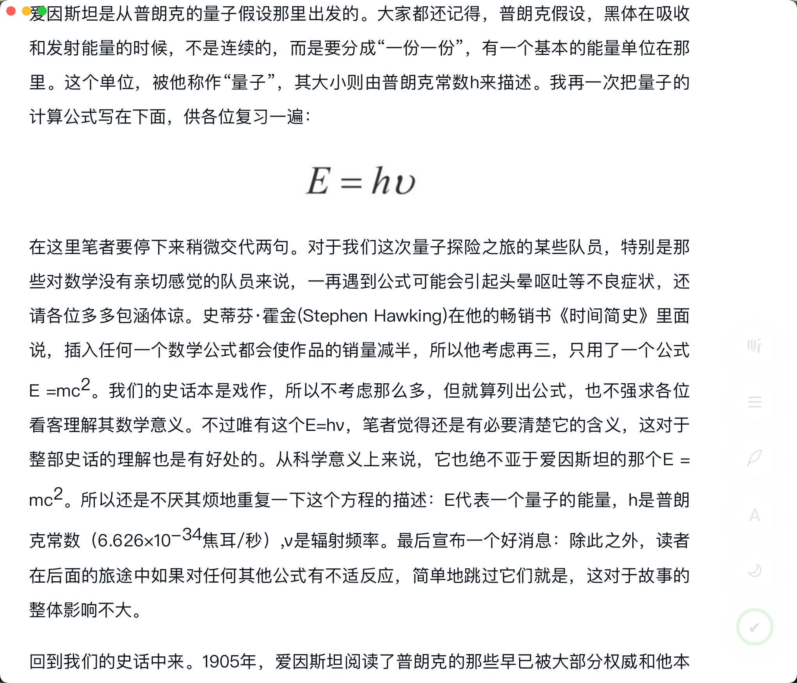

# 基于Tauri简单封装的微信阅读Mac的客户端 

使用方式：
1. 本地构建 **yarn build**
2. 下载已构建的版本，本地安装

功能说明：
1. 定制阅读页面部分样式
   - 隐藏顶部的导航栏； 
   - 修改页面的宽度
   - 优化右侧导航条展示

2. 新增阅读倒计时，默认一次15min分钟 （点击图标或 command + s 可以暂停/开始倒计时）
3. 增加快捷键操作，快捷翻页、滚动页面等

快捷键说明：
> 具体实现在 src-tauri/inject/event.js 中

1. j：往下滚动 2 * 120px；
2. J：往下滚动 5 * 120px；
3. 1-9j：往下滚动 num * 120px；
4. k： 往上滚动 2 * 120px；
5. K： 往上滚动 5 * 120px；
6. 1-9k：往上滚动 num * 120px；
7. G： 滚动到底部
8. gg： 滚动到顶部
9. n： 下一章
10. p： 上一章
11. w： 往上滚动 2 * 120px，等同于 k
12. s： 往下滚动 2 * 120px，等同于 j
13. d： 下一章，等同于 n
14. a： 上一章，等同于 p
15. space：往下翻一屏
16. shift + space：往上翻一屏
17. command + b：回到书架
18. command + [：后退
19. command + ]：前进
20. command + s：暂停/开始倒计时
21. command + b：返回书架，未登录时回到首页

可以结合 raycast设置一个全局启动的快捷键，如果没使用raycast 也可修改 main.rs 添加一个快捷键
